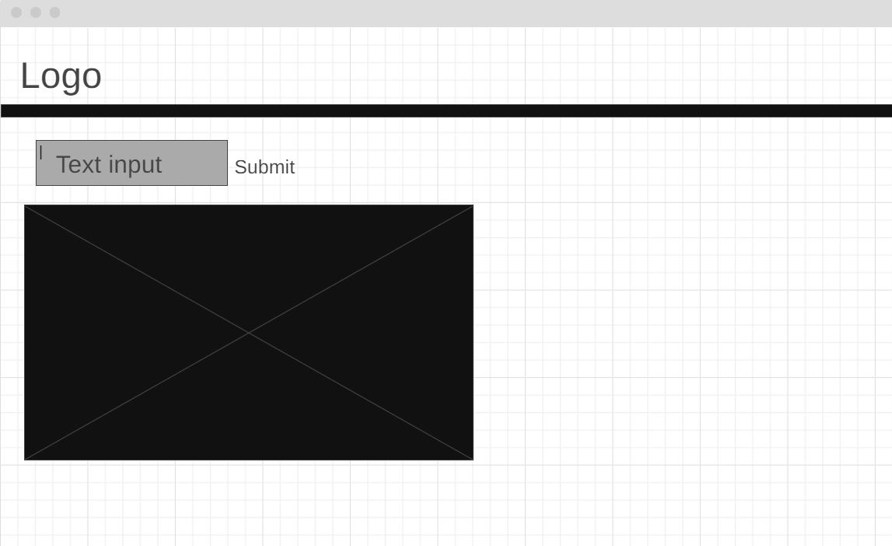
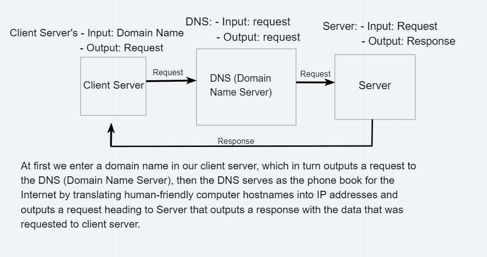
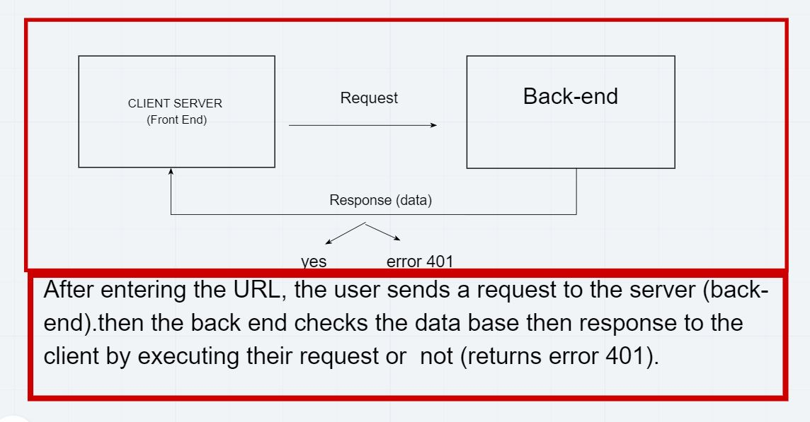

# City Explorer

**Author**: Yousef Salem

**Version**: 1.0.0 (increment the patch/fix version number if you make more commits past your first submission)

## Overview

In my project, I built a web page that displays location information and renders a site map depending on the user's input, using Location IQ Geocoding API. The reason behind this project is to provide a tool that helps people by providing location information based on user's input the of location name, also rendering a map of the site.

## Getting Started

1. First we have to create our repository, and add react app inside of it.
2. Build static page of the page components without any interactivity between them.
3. Implement API, to get our data base from.
4. Make the page interactive by adding state to it, and use the state to render the value of the form in our page.

## Architecture

In this project HTML, CSS, and JavaScript was used to build it. Multiple librarys were used  such as React JS, Axios that helps us get data from external resources.
The basic design for this web page is illustrated in the wireframe below

## Change Log

03-05-2021 01:30am: My project has a react application containing a form, and connected with a web server API to get data from depending on user input to form.
04-05-2021 12:30pm: Application now has a fully-functional express server, with a GET route for the location resource.

## Credit and Collaborations

- [React-bootstrap](https://react-bootstrap.netlify.app/) was used to style my web page.
- [Location IQ](https://locationiq.com/) as a web server API to retrieve data from.
- [npm](https://www.npmjs.com/) to download packages I used for my project.
- [Wire Frame](https://wireframe.cc/) was used to create wire frame for my web page.
- [Fonts Awesome](https://fontawesome.com/) where I got my icons from.
- [Color Palette](https://coolors.co/palettes/trending), where you can find my color set.
- [Dania Abughoush](https://github.com/DaniaAbughoush) has reviewed my code in lab-06.
- [Sufian Hamdan](https://github.com/SufianHamdan) has reviewed my code in lab-07.

## Time Estimation

### Lab 06

Name of feature: Asynchronous code, and APIs

Estimate of time needed to complete: 5 hours

Start time: 08:00pm 

Finish time: 01:30am
Actual time needed to complete: 5.5 hours

_web request-response cycle for the current lab_

### Lab 07

Name of feature: Custom Servers with Node and Express

Estimate of time needed to complete: 3 hours

Start time: 10:00pm 

Finish time: 12:30:00am
Actual time needed to complete: 2.5 hours

_web request-response cycle for the current lab_

